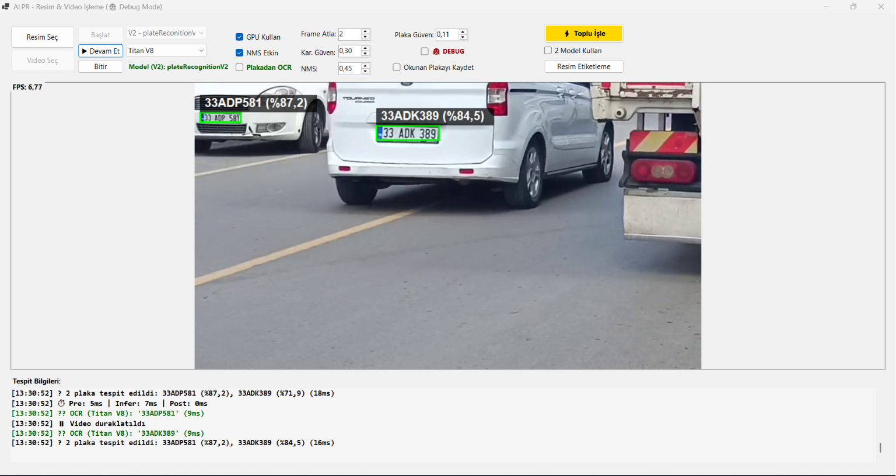

# ALPR - Automatic License Plate Recognition System

ALPR is a real-time license plate recognition application that detects and reads plates from images and videos using .NET, OpenCV and ONNX models.

## Features ✨

- Image processing: JPG, PNG, BMP, TIFF
- High accuracy using ONNX deep learning models
- Multi-plate detection in a single image
- OCR integration for automatic plate text recognition
- Real-time video processing with frame skipping and FPS indicator
- Parallel processing (multi-threaded) for performance
- Automatic logging of detected plates

## Screenshots 📷

Main UI with detected plate (example):


Example license plate detection (image mode):



## Technologies 🛠️

- Framework & Language: .NET (net10.0-windows7.0) / C#
- UI: Windows Forms
- AI/ML: ONNX Runtime (GPU support optional), YOLO-style detection runners, custom OCR models
- Image processing: OpenCvSharp, System.Drawing
- NuGet packages (as in `ALPR.csproj`):

```
<PackageReference Include="Microsoft.ML.OnnxRuntime.Gpu" Version="1.26.0" />
<PackageReference Include="OpenCvSharp4" Version="4.13.0.20260602" />
<PackageReference Include="OpenCvSharp4.Extensions" Version="4.13.0.20260602" />
<PackageReference Include="OpenCvSharp4.runtime.win" Version="4.13.0.20260602" />
<PackageReference Include="System.Numerics.Tensors" Version="10.0.8" />
<PackageReference Include="SharpCompress" Version="0.49.1" />
```

## Installation ⚙️

Requirements:

- Windows 10/11 (64-bit)
- .NET 9.0 SDK or Runtime
- Visual Studio 2022 (optional)
- At least 4GB RAM (GPU optional for acceleration)

Steps:

```bash
git clone https://github.com/yourusername/ALPR.git
cd ALPR
```

Place the ONNX model files expected by the app in the `models/` folder (filenames used by the UI code):

- `models/LicencePlateDetection_Gpu.onnx`        # V1 plate detector (GPU-ready variant)
- `models/plateRecognitionV2.onnx`               # V2 plate recognition model (YOLO runner)
- `models/cct_s_v1_global.onnx`                  # OCR model (S variant)
- `models/titan_armor_v8.onnx`                   # Titan V8 OCR/detector (optional)
- `models/parseq_fp16_fp32_sim.onnx`             # Parseq OCR model (optional)

Note: `frmALPR` will show "(Bulunamadı)" if a model file is missing.

Build:

```bash
dotnet restore
dotnet build --configuration Release
```

Run:

```bash
dotnet run --project ALPR/ALPR.csproj
```

Or open the solution in Visual Studio and run with F5.

## Usage 🧭

Image mode:

1. Click `Resim Seç` (Select Image)
2. Choose an image to process
3. Configure settings in the UI (defaults shown):
  - Plate confidence (`Plaka Güven`): default 0.11
  - NMS IoU (`NMS`): default 0.45
  - Character confidence (`Kar. Güven`): default 0.03
4. Start processing and review the log area (`Tespit Bilgileri`)

Video mode:

1. Click `Video Seç` (Select Video)
2. Choose a video file (MP4, AVI, MKV, MOV)
3. Set `Frame Atla` (Frame Skip): default 2 (process every 3rd frame); 0 = every frame
4. Click `Başlat` (Start) and monitor FPS and detections

## Configuration and Tuning 🔧

- Default detection + UI values (from `frmALPR`):
  - Plate confidence (`nudConfidenceThreshold`): 0.11
  - NMS IoU (`nudNMSThreshold`): 0.45
  - Character confidence (`nudCharConfidence`): 0.03
  - Frame skip (`nudFrameSkip`): 2

Recommended presets (adjust to your hardware and use case):

- High quality: Confidence 0.70, NMS 0.45, Frame Skip 0
- Balanced: Confidence 0.60, NMS 0.45, Frame Skip 2
- Fast: Confidence 0.50, NMS 0.50, Frame Skip 5

## Performance Benchmarks 📈

Single image processing (approximate):

- 640x480, 1 plate — ~45ms (22 FPS)
- 1280x720, 2 plates — ~75ms (13 FPS)
- 1920x1080, 3 plates — ~120ms (8 FPS)

Video processing (1280x720) examples:

- Frame skip 0: CPU ~85%, RAM ~450MB — FPS 8–10
- Frame skip 2: CPU ~60%, RAM ~400MB — FPS 18–20
- Frame skip 5: CPU ~40%, RAM ~350MB — FPS 30–35

## Project Structure 📁

```
ALPR/
  Detection/
    LicensePlateDetector.cs
    PlateCharDetector.cs
    OcrStitcher.cs
  frmALPR.cs
  Program.cs
  ALPR.csproj
  LicencePlateDetection.onnx
  PlateLetterExtraction.onnx
```

## API Summary 📚

`LicensePlateDetector` class:

```csharp
public sealed class LicensePlateDetector : IDisposable
{
    public LicensePlateDetector(string modelPath);
    public DetectionResult Detect(Bitmap originalImage, float confidenceThreshold, bool enableNms, float nmsThreshold);
}
```

`PlateCharDetector` class:

```csharp
public sealed class PlateCharDetector : IDisposable
{
    public PlateCharDetector(string modelPath, bool swapRB = false);
    public CharacterDetectionResult Detect(Bitmap roiBitmap, float confidenceThreshold, bool enableNms, float nmsThreshold);
}
```

`OcrStitcher` helper:

```csharp
public static class OcrStitcher
{
    public static string Stitch(IReadOnlyList<PlateCharDetection> predictions, string readingDirection = "left_to_right", float? tolerancePx = null);
}
```

## Development & Contribution 🚀

Add a feature branch, implement, test, and open a pull request:

```bash
git checkout -b feature/my-feature
# implement changes
git commit -m "feat: add my feature"
git push origin feature/my-feature
# Open a PR from your fork or branch
```

Commit message conventions:

- `feat:` new features
- `fix:` bug fixes
- `docs:` documentation
- `style:` formatting
- `refactor:` refactoring
- `perf:` performance improvements
- `test:` adding tests

## GPU & Execution Providers ⚠️

The project includes code to attempt GPU execution providers. The `ExecutionProviderHelper` checks available providers and the app exposes a `GPU Kullan` checkbox in the UI. If GPU is not available th[...]

If you encounter provider errors, check the app log area (`Tespit Bilgileri`) which shows detected providers and helpful diagnostics.

## Known Issues

- Webcam support is not yet available (planned for v2.0)
- Some video codecs may not be supported — convert with FFmpeg if needed

## Roadmap 🛣️

- v2.0: Webcam real-time support, GPU acceleration, plate database, REST API
- v2.1: Multi-language OCR, video recording, auto model updates
- v3.0: Model training UI, batch processing, analytics

## License

This project is licensed under the MIT License. See the `LICENSE` file for details.

## Acknowledgements

- OpenCV
- ONNX Runtime
- YOLOv8
